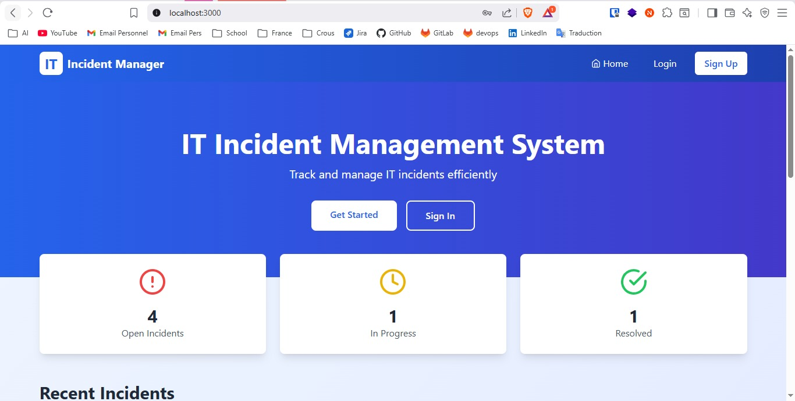
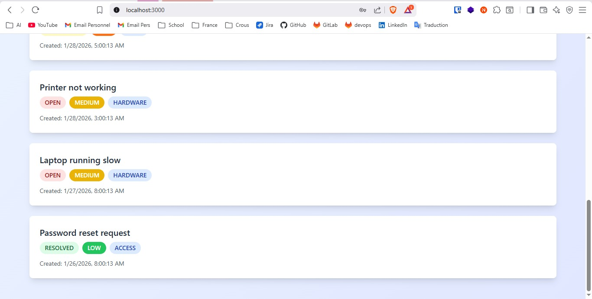
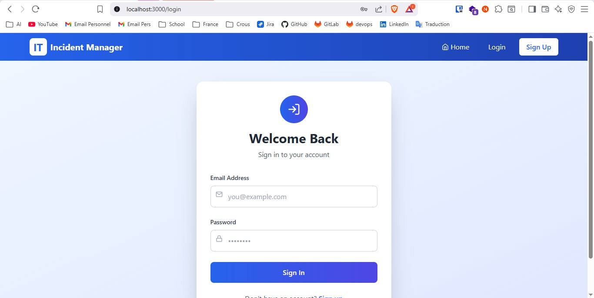
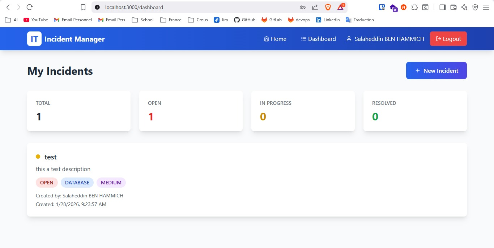
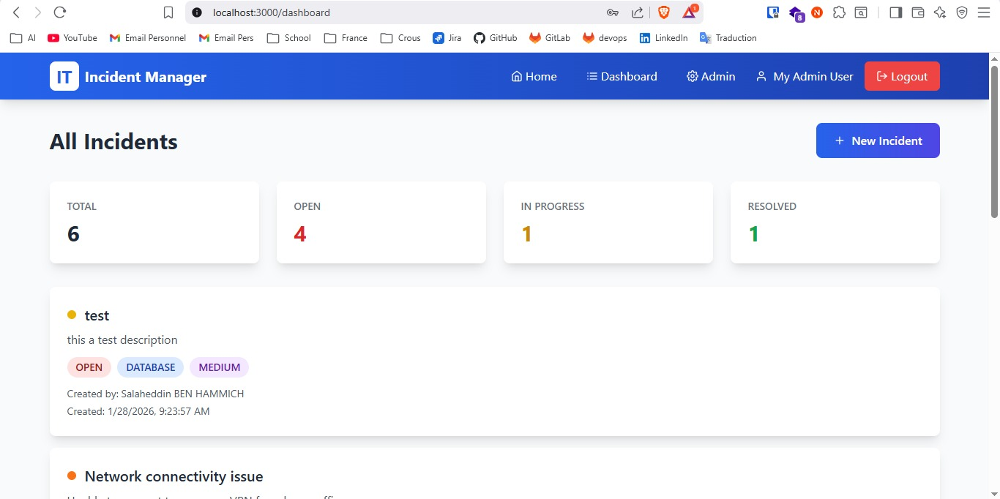
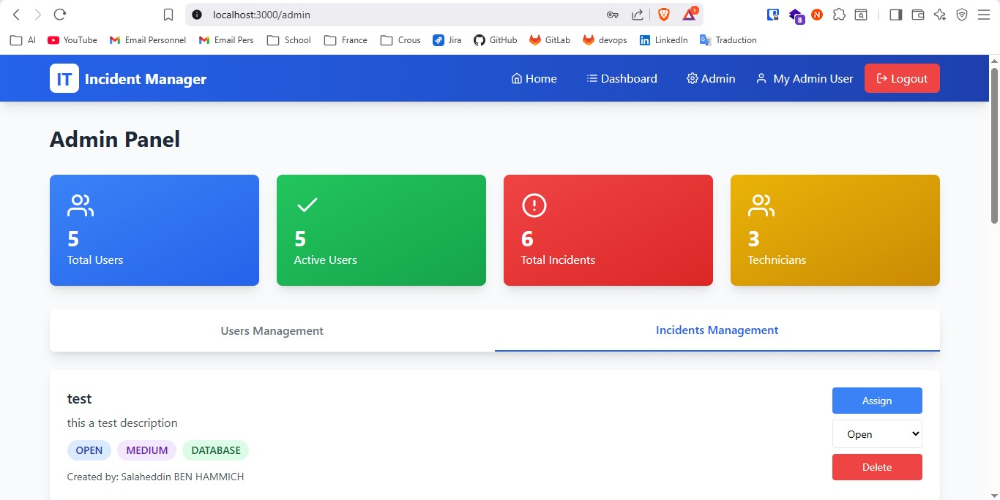
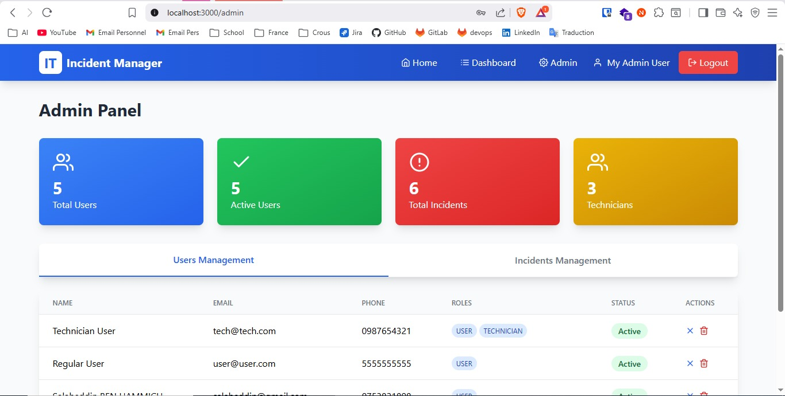

# Incident Management Project

This project is a **full-stack web application** composed of:
- **Backend**: Spring Boot (Java)
- **Frontend**: Next.js (React)
- **Database**: MySQL (running in Docker)

The backend and frontend run **locally**, while the database runs **inside Docker**.

---

## 📸 Application Screenshots

### 🏠 Visitor Homepage
| Page 1 | Page 2 |
|------|------|
|  |  |

---

### 🔐 Authentication
| Login | Register |
|------|---------|
|  |  |

---

### 👤 User Dashboard


---

### 🛠️ Admin Dashboard


---

### 🎫 Ticket Management (Admin)


---

### 👥 User Management (Admin)


---

## 🚀 How to Run the Project


## ⚙️ Prerequisites

Make sure you have the following installed:

- **Java 17+**
- **Maven**
- **Node.js 18+** (recommended for Next.js)
- **npm / yarn / pnpm**
- **Docker & Docker Compose**
- **Git**

---

## 🐳 Database (MySQL with Docker)

The MySQL database runs inside Docker.

### Start MySQL container

```bash
docker run -d \
  --name incident-mysql \
  -e MYSQL_ROOT_PASSWORD=root \
  -e MYSQL_DATABASE=incident_db \
  -p 3306:3306 \
  mysql:8.0
```

### Verify MySQL is running

```bash
docker ps
```
### 2️⃣ Execute the setup SQL script

Make sure the file `setup.sql` is available on your machine.

Run the following command:

```bash
docker exec -i incident-mysql mysql -u root -p incident_db < setup.sql
```

Enter the MySQL root password when prompted.

This script will:
- Create demo users (Admin, Technician, User)
- Assign correct roles
- Create sample incidents
- Assign incidents to technician

---

## 🔐 Demo Users & Credentials

> ⚠️ These credentials are **for development/demo only**.

| Role | Email | Password |
|----|------|----------|
| **Admin** | myadmin@example.com | admin123 |
| **Technician** | tech@example.com | tech123 |
| **User** | salaheddin@gmail.com | Salah-2026 |

Passwords are stored securely using **BCrypt hashing** in the database and cannot be retrieved in plain text.

---

## 🚀 Backend (Spring Boot)

### 1. Navigate to backend

```bash
cd it-incidents-backend
```

### 2. Configure database connection

Check `application.yml` or `application.properties`:

```properties
spring.datasource.url=jdbc:mysql://localhost:3306/incident_db
spring.datasource.username=root
spring.datasource.password=root
```

> ⚠️ `localhost` works because Docker exposes MySQL on port `3306`.

### 3. Start backend

```bash
mvn spring-boot:run
```

Wait until you see:

```
Started ItIncidentsBackendApplication
```

Backend will run on:

```
http://localhost:8080
```

---

## 👤 Create User (Required First Time)

using postman for example

```bash
POST http://localhost:8080/api/auth/register
```

BODY :

```
{
  "email": "user@example.com",
  "password": "user123",
  "fullName": "User",
  "phone": "1234567890"
}
```

## 🌐 Frontend (Next.js)

### 1. Navigate to frontend

```bash
cd frontend
```

### 2. Install dependencies

```bash
npm install
```

### 4. Start frontend

```bash
npm run dev
```

Frontend will run on:

```
http://localhost:3000
```

---

## 🔐 Default Admin Credentials

```
Email:    admin@admin.com
Password: admin123
```

> Password is already **BCrypt-hashed** in the database.

---
